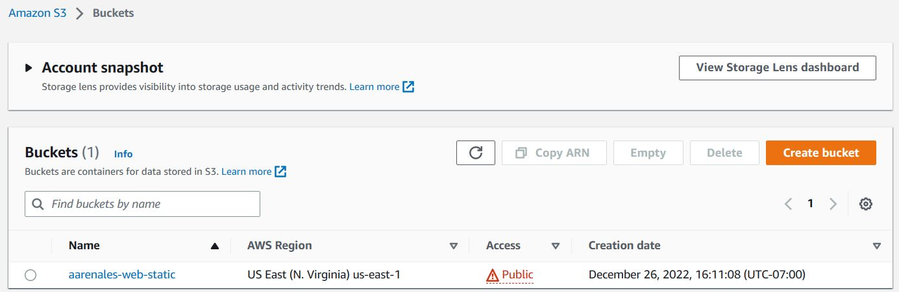
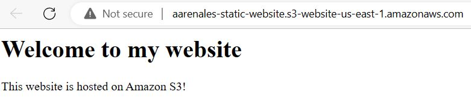

# StaticWebsiteS3
Here are described the steps to create a static website hosted on Amazon S3.

## Steps for creating a static website hosted on Amazon S3

1. **Creating a bucket**

First, you need to go to the Amazon S3 console and click on *Create a bucket* to store the data. After that, you need to insert a bucket name that must be globally unique and choose the AWS region that is close to where you are located. The others settings I left as default. Then I created the bucket. 

2. **Upload the object**

After the bucket is created, the file [index.html](index.html) was uploaded into the bucket. Under the *Object* tab if you click on that file you will have more details about it.

3. **Bucket Policy**

To make the file public is necessary to go to the *Permissions* tab and allow public access.  For that, I disabled the *Block all public access*. 

> Before doing this make sure you really want to make the files on that bucket public.  

Next, go to *Bucket policy* and click on *Edit*. Then, select the *Policy generator*. In the *Select Type of Policy* click on *S3 Bucket Policy*; in *Effect* click on *Allow*; in *Principal* you need to write `*` because you want to allow everyone on the Amazon S3 Service to read the object on the bucket. In *Actions*, you need to select *GetObject* and in *Amazon Resource Name (ARN)* needs to be your `bucket name + /*` (for example, in my case was: `arn:aws:s3:::aarenales-web-static/*`). After all this is done, you click on *Generate Policy*. This will save the changes and generate the [policy](https://github.com/AmandaArenales/StaticWebsiteS3/blob/main/S3_bucket_policy.txt) that you will use later on the *Bucket Policy*. Below you can see the fragment of the page filled:

4. **Creating a static website hosting**

In the tab *Properties*, scroll down until *Static website hosting*.  Next click on *Edit*, and select *Enable* on the *Static website hosting* section. After that specify your index document, in my case [index.html](index.html), and save it. Back to the *Properties* tab, scroll down again and you will see under the *Static website hosting* a *Bucket website endpoint*, where you can copy the URL to your website.

